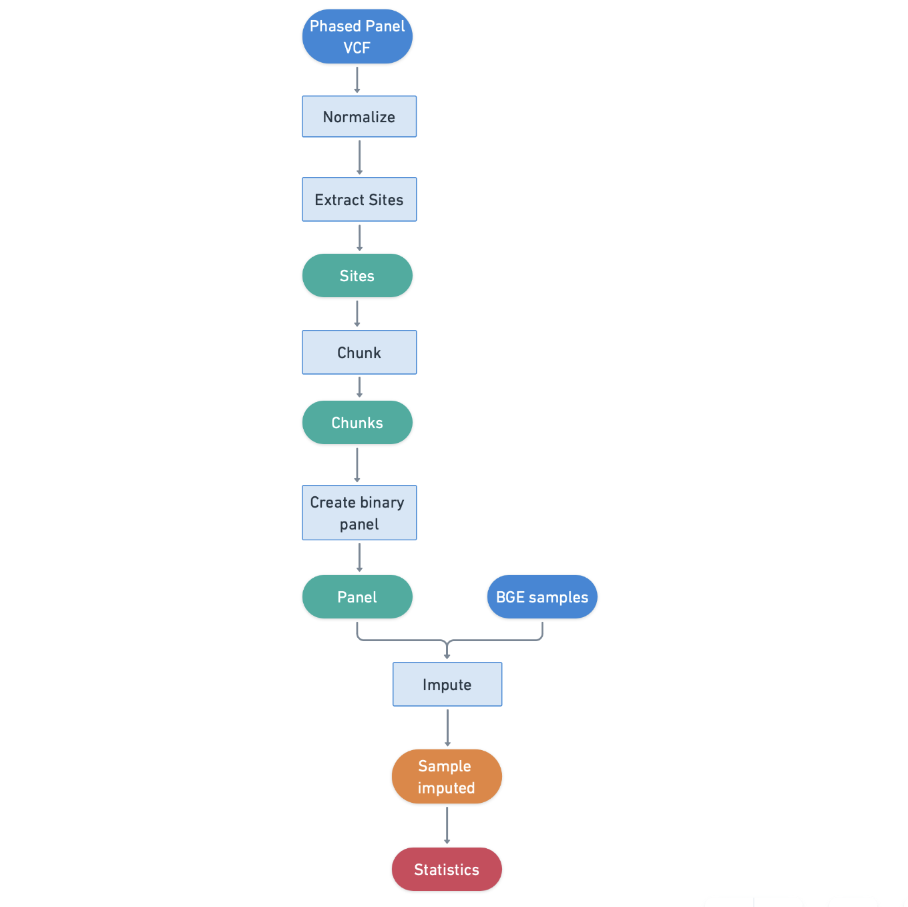

# Blended_seq_imputation
### Contributors
Phil Greer
Kara 
Tien Li
Yuning Zheng

## Introduction

## Methods
Using the Human Genome Diversity Project + 1000 Genomes combined, phased  dataset, we will implement a nextflow pipeline consisting of 3 steps 
(possibly 4 steps). 

1) extract the site information for the entire cohort. 

2) chunk out the reference data using GLIPMSE_chunk. 

3) split out the reference chromosomes into binary chuks for all chromosomes.

Possible testing based on available BGE data

### Data
Four our inital test. we will be using the Human Genome Diversity Project + 1000 Genomes combined dataset. The phased version of the dataset can be 
found on the gnomAD publis cloud folders on Google: gs://gcp-public-data--gnomad/resources/hgdp_1kg/phased_haplotypes_v2 and on AWS: 
s3://gnomad-public-us-east-1/resources/hgdp_1kg/phased_haplotypes_v2

### Workflow

## Results

## Discussion

## References

