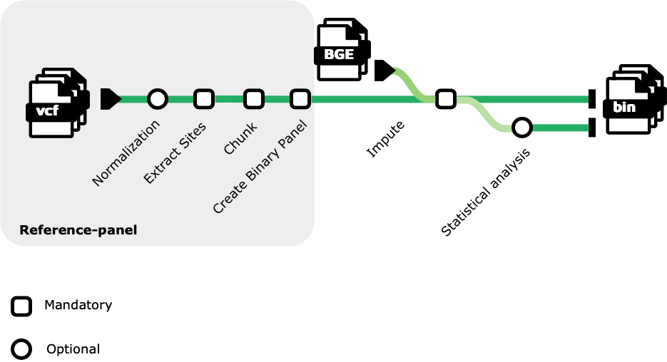

> Machine Learning and AI Approaches to Multimodal Problems in Computational Biology Hackathon (CMU Libraries and DNAnexus), Mar 03-05, 2025
# Blended_seq_imputation
### Contributors
* Phil Greer
* Tien Ly
* Yuning Zheng
* Gobikrishnan Subramaniam

## Introduction

Blended Genome Exome (BGE) sequencing is an innovative approach developed by the Broad Institute that integrates low-pass whole genome sequencing (WGS) at approximately 3x coverage with 30x coverage whole exome sequencing (WES) on a unified sequencing platform. Unlike traditional genotyping arrays, BGE and low-pass WGS are not limited by predefined probe sets based on specific ancestral data, making them more inclusive for diverse populations. To obtain accurate variant calls for common variants across the genome, both BGE and low-pass WGS data require an imputation step, which relies on high-quality reference panels comprising large, ancestrally diverse samples. In this project, we aim to develop a Nextflow workflow to construct such an imputation reference panel using extensive cohort datasets, leveraging resources like the 1000 Genomes Project (1kGP) and the Human Genome Diversity Project (HGDP), which have been harmonized to create a comprehensive resource of deeply sequenced human genomes.

## Methods

Building upon [GLIMPSE2's tutorial](https://odelaneau.github.io/GLIMPSE/docs/tutorials/getting_started/), which provides bash script snippets for generating reference panels from a single chromosome (specifically, chromosome 22 of the 1000 Genomes Project b38 data from the EBI FTP site), we developed a scalable Nextflow pipeline capable of processing all chromosomes in our dataset. Due to the complexities associated with chromosome X, it was excluded from this project.

Our pipeline utilizes the combined, phased dataset from the HGDP and the 1000 Genomes Project, available in the gnomAD public cloud folders on [Google Cloud Platform](gs://gcp-public-data--gnomad/resources/hgdp_1kg/phased_haplotypes_v2) and [AWS](s3://gnomad-public-us-east-1/resources/hgdp_1kg/phased_haplotypes_v2). The pipeline comprises four main steps:

1) Conversion of multiallelic sites: Transform all multiallelic sites into biallelic sites, retaining both single nucleotide polymorphisms (SNPs) and insertions/deletions (indels)

2) Extraction of site information: Extract site information for the entire cohort

3) Chunking reference data: Divide the reference data using GLIMPSE2_chunk

4) Splitting reference chromosomes: Segment the reference chromosomes into binary chunks for all chromosomes

The software tools employed include [bcftools](https://samtools.github.io/bcftools/), [GLIMPSE2](https://odelaneau.github.io/GLIMPSE/), [Nextflow](https://github.com/nextflow-io/nextflow), and [Docker](https://github.com/docker).

### Workflow

## Results

## Discussion

## References

